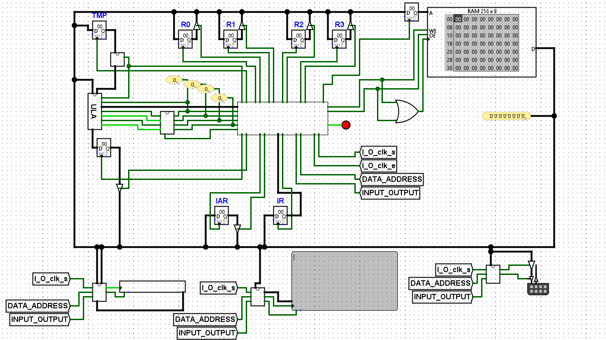

# 🧠 CPU de 8 bits em Logisim

Projeto de uma CPU de 8 bits criada do zero no [Logisim Evolution](https://github.com/reds-heig/logisim-evolution), com suporte a um conjunto básico de instruções programáveis.

---

## Tradução de algoritmo Assembly -> Hexadecimal

Em breve...

---

## 🏗 Arquitetura

- **Tamanho da palavra:** 8 bits
- **Registradores:**
  - `IAR` (Instruction Address Register)
  - `IR` (Instruction Register)
  - `ACC` (Acumulador)
  - `TMP` (Temporário/auxiliar)
  - `R0` Registrador 0
  - `R1` Registrador 1
  - `R2` Registrador 2
  - `R3` Registrador 3
- **Memória RAM:** 256 posições de 8 bits
- **Teclado, Monitor e Porta I/O**

---

